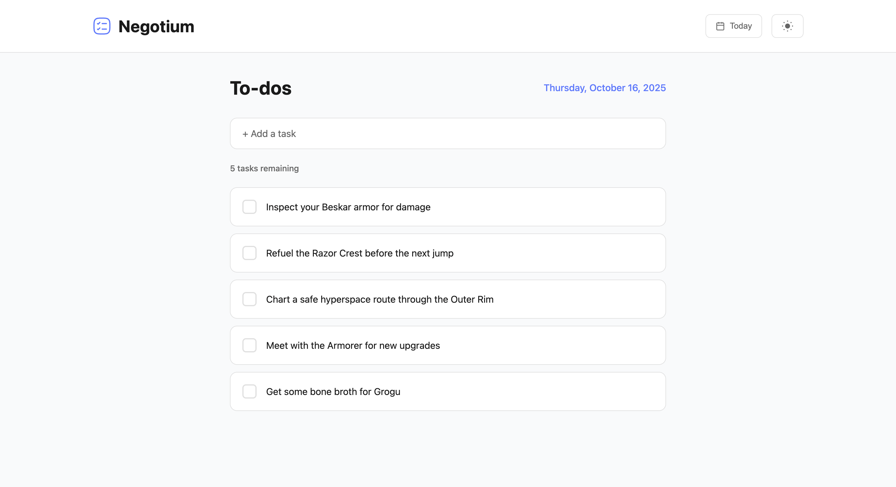

# Negotium - Minimalist To Do App

A beautiful, minimal to-do list application featuring smooth animations, intelligent date management, and a modern design that helps you stay organized and productive.



## 💭 Why Negotium?

While powerful tools like Trello and Vikunja excel at managing complex projects and long-term planning, sometimes you just need a simple, focused space for your daily tasks. That's why I built Negotium, a straightforward to-do list for today and tomorrow. Nothing more, nothing less.

Built with Svelte for speed and simplicity. No overwhelming features, no endless project boards, no complexity. Just a clean interface for your daily workflow.

## ✨ Features

### Core Functionality
- ✅ **Add, complete, and delete tasks** with smooth animations
- ↩️ **Undo** - `Cmd/Ctrl+Z` brings back a deleted task, in its original position
- 📅 **Today & Tomorrow lists** - Plan ahead with separate task lists
- 🔄 **Unfinished work carries over** - When a new day begins, tasks you didn't finish move to Today; completed ones are cleared away
- ➡️ **Push a task to tomorrow** - Didn't get to it? Move it across without retyping it
- 🎯 **Reorder by drag or keyboard** - Drag with a mouse, long-press and drag on touch, or use `Alt+↑`/`Alt+↓`
- 💾 **Persistent storage** - All tasks saved locally in your browser
- 📊 **Task statistics** - See how many tasks remain at a glance
- 📱 **Installable and works offline** - Add it to your home screen or dock and it runs with no connection
- 📦 **Export and import** - Take your tasks with you, or keep a backup

## 🚀 Getting Started

### Quick Start with Docker (Recommended)

Pull and run the pre-built Docker image:

```bash
# Pull the image
docker pull ghcr.io/aculix/negotium:main

# Run the container
docker run -d -p 3000:80 --name negotium ghcr.io/aculix/negotium:main
```

Then open `http://localhost:3000` in your browser.

To stop the container:
```bash
docker stop negotium
docker rm negotium
```

### Manual Installation

If you prefer to run the application locally without Docker:

1. Clone the repository:
```bash
git clone <repository-url>
cd negotium
```

2. Install dependencies:
```bash
npm install
```

3. Start the development server:
```bash
npm run dev
```

4. Open `http://localhost:3000` in your browser

#### Build for Production

```bash
npm run build
```

The optimized files will be in the `dist` directory.

#### Running the Tests

```bash
npm test
```

The date, storage, rollover, task and undo logic lives in `src/lib/` as plain modules that take the current time as an argument, so behaviour at a day boundary is covered by ordinary unit tests rather than by waiting for midnight.

## 📖 How to Use

### Managing Tasks
- **Add a task**: Type in the input field and press Enter
- **Complete a task**: Click the checkbox next to the task
- **Delete a task**: Click the delete icon on the task (it shows on hover, and is always visible on touch), or press `Delete` with the task focused
- **Undo a delete**: Press `Cmd/Ctrl+Z`. The task returns to where it was
- **Move a task to Tomorrow**: Click the arrow on the task, or press `Alt+→`. From Tomorrow, the arrow points back and `Alt+←` returns it to Today
- **Reorder tasks**: Drag with a mouse, long-press then drag on touch, or focus a task and press `Alt+↑`/`Alt+↓`
- **Clear input**: Press Escape while the input is focused

### Date Management
- **Switch between Today and Tomorrow**: Click the date button in the header
- **Plan ahead**: Add tasks to Tomorrow's list before you need them
- **Separate lists**: Today and Tomorrow maintain independent task lists
- **Carry-over**: When a new day begins, whatever you didn't finish moves into Today. Completed tasks are cleared away with the day they belonged to. It works across gaps too. If you don't open Negotium for a week, everything still outstanding is waiting for you.
- **While it's open**: The app notices the day change on its own, so a tab left open overnight rolls over without a reload.

### Installing It

Negotium is a PWA, so it installs like an app and runs without a connection.

- **iPhone and iPad**: open it in Safari, tap Share, then Add to Home Screen
- **Android**: Chrome offers Install from the menu, or prompts you directly
- **Desktop**: Chrome and Edge show an install button in the address bar

Once installed it opens in its own window with no browser chrome, and works on a plane. The app never needed the network for anything beyond loading itself.

### Backing Up and Moving Between Devices

Everything lives in one browser's storage, so `Export` writes it all to a JSON file you can keep or carry somewhere else. `Import` reads that file back.

Import only ever adds. Tasks already present are left alone, so importing the same file twice changes nothing and importing into a list you're already using can't lose anything. The flip side is that import restores rather than reverts: it won't undo work you did after the export.

### Theme Toggle
- Click the sun/moon icon in the header to switch themes
- Your preference is saved automatically and restored on reload
- Respects system dark mode preference on first visit

### Keyboard Shortcuts
- **Enter**: Add task (when input is focused)
- **Escape**: Clear input field (when input is focused)
- **Space/Enter**: Toggle task completion (when a task's checkbox is focused)
- **Delete**: Delete the focused task
- **Cmd/Ctrl+Z**: Undo the last delete or clear-completed
- **Alt+↑ / Alt+↓**: Move the focused task up or down
- **Alt+→ / Alt+←**: Send the focused task to Tomorrow, or bring it back to Today

Backspace no longer deletes a task. It is too easily pressed by accident, and deletions used to be unrecoverable.

## 💾 Data Storage

All data is stored locally in your browser using localStorage:
- **Tasks**: One key per date, in ISO form (`negotium-tasks-2026-08-15`)
- **Theme**: Your theme preference (`negotium-theme`)
- **No server required**: Everything runs entirely client-side
- **Privacy first**: Your data never leaves your device
- **Self-pruning**: Past days are removed as their unfinished tasks carry forward, so storage doesn't grow without bound
- **Yours to take**: Export writes everything to a JSON file, so your tasks aren't trapped in one browser

Earlier versions keyed tasks by a different date format (`negotium-tasks-Sat Aug 15 2026`). Those convert automatically the first time you open this version. Nothing to do, and nothing is lost.

## 📄 License

MIT License - Free for personal and commercial use.

## 🤝 Contributing

Contributions are welcome! Feel free to submit issues and pull requests.
